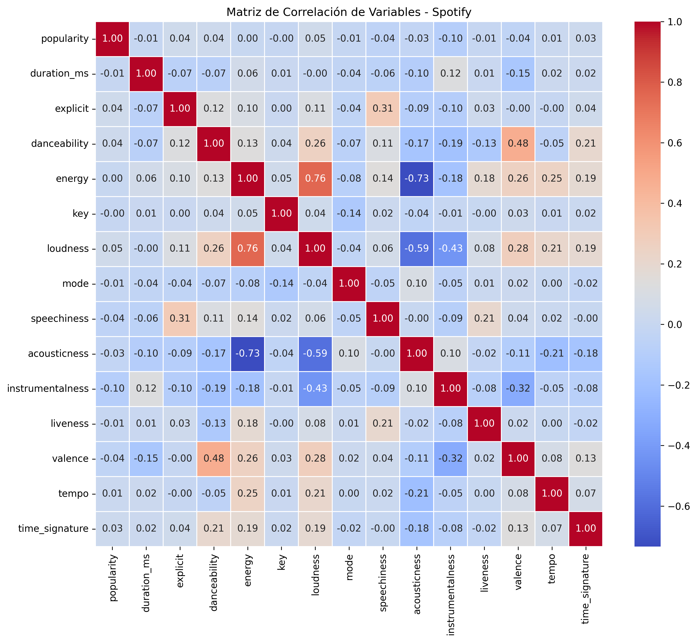
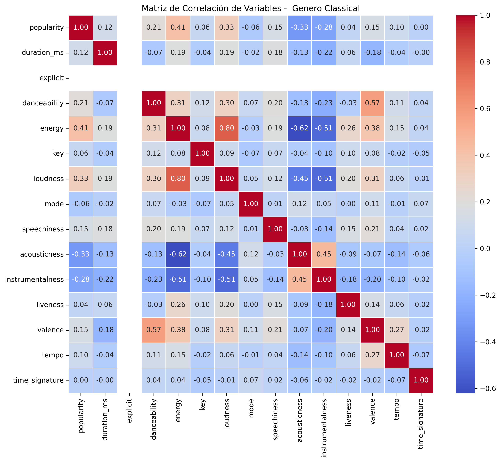
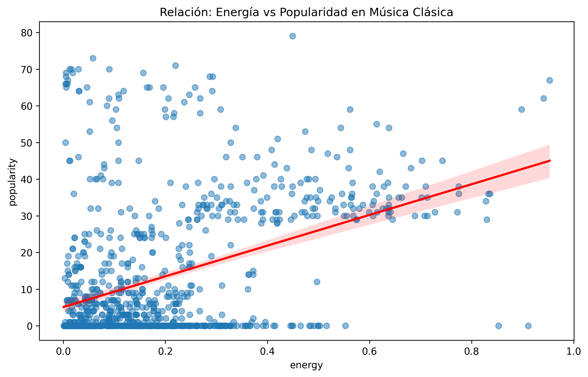
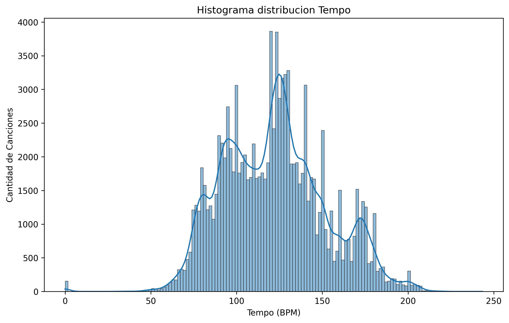
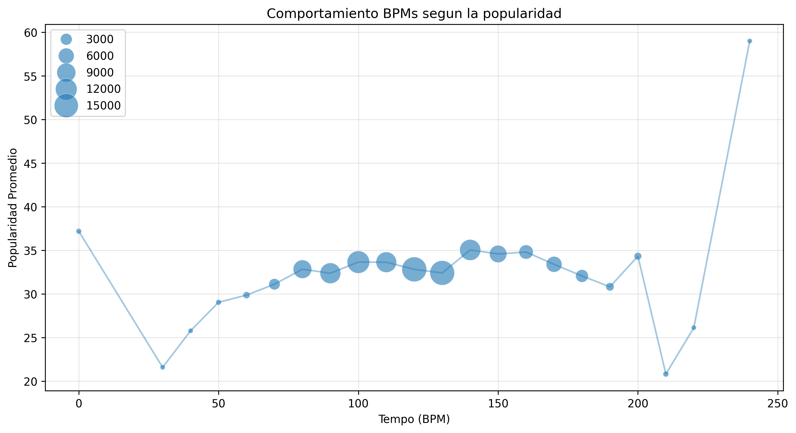
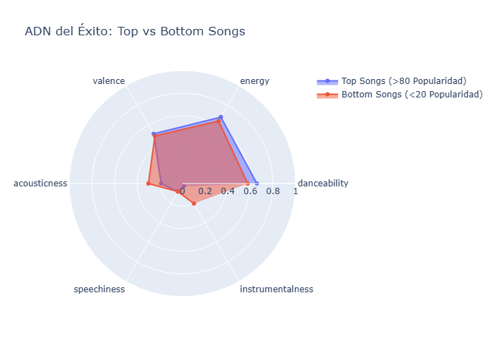

# 🎵 Spotify Success Analysis: Descodificando el ADN de los Hits

Este proyecto realiza un análisis profundo de los atributos de audio que definen la popularidad en Spotify. A través de técnicas de Ciencia de Datos, identificamos qué características técnicas (ritmo, energía, acústica) diferencian a las canciones que dominan las listas de aquellas con menor impacto comercial.

---

### 🛠️ Tecnologías Utilizadas

El análisis y las visualizaciones se desarrollaron utilizando el ecosistema de **Python** 🐍:

* **Pandas:** Estructuración y limpieza del dataset de Spotify.
* **Plotly Express / Graph Objects:** Generación de gráficos de radar (Spider Charts) y diagramas de dispersión interactivos.
* **NumPy:** Cálculos estadísticos para la normalización de perfiles musicales.
* **Scipy / Statsmodels:** Evaluación de correlaciones entre métricas de audio y popularidad.

---

### 📊 Diccionario de Datos Completo y Guía de Interpretación

| Variable | Descripción | Tipo | Interpretación para el Análisis |
| :--- | :--- | :--- | :--- |
| **Identificadores** | | | |
| `artists` | Artista(s) de la pista. | Cadena | Útil para identificar qué artistas dominan el éxito. |
| `album_name` | Nombre del álbum. | Cadena | Permite ver si ciertos álbumes tienen éxito uniforme. |
| `track_name` | Nombre de la canción. | Cadena | Identificador único de la obra. |
| `track_genre` | Género de la pista. | Cadena | **Variable de Segmentación:** Para comparar estilos. |
| **Métricas de Éxito** | | | |
| `popularity` | Popularidad (0-100). | Entero | **Variable Objetivo:** El "éxito" que queremos explicar. |
| **Atributos de Audio** | | | |
| `danceability` | Aptitud para el baile (0-1). | Flotante | > 0.7 indica ritmos muy estables y bailables. |
| `energy` | Intensidad y actividad (0-1). | Flotante | Representa qué tan "fuerte" o rápida se siente la pista. |
| `loudness` | Sonoridad promedio (dB). | Flotante | Volumen físico. Valores más altos (ej. -5) son más fuertes. |
| `valence` | Positividad (0-1). | Flotante | Mide la "alegría" (Cercano a 1) vs "tristeza" (Cercano a 0). |
| `tempo` | Velocidad en BPM. | Flotante | El pulso de la canción; clave para el ritmo. |
| `acousticness` | Nivel acústico (0-1). | Flotante | 1.0 indica alta probabilidad de ser una pista acústica. |
| `instrumentalness` | Probabilidad instrumental. | Flotante | > 0.5 sugiere que la canción no tiene voces. |
| `speechiness` | Presencia de habla (0-1). | Flotante | > 0.6 indica que es casi puro contenido hablado. |
| `liveness` | Grabación en vivo (0-1). | Flotante | Detecta la presencia de público en la grabación. |
| **Detalles Técnicos** | | | |
| `duration_ms` | Duración en ms. | Entero | Longitud de la pista; útil para ver tendencias de tiempo. |
| `explicit` | Contenido explícito. | Booleano | Determina si el lenguaje fuerte afecta el alcance. |
| `key` | Tonalidad (0-11). | Entero | La nota base de la canción (C, C#, D, etc.). |
| `mode` | Modalidad (0 o 1). | Entero | 1 = Mayor (más brillante), 0 = Menor (más sombrío). |
| `time_signature` | Compás de la pista. | Entero | Número de pulsos por compás (ej. 4/4). |


## 📊 Preguntas de Negocio

### 1. ¿Cuáles son los atributos de audio que más influyen en la Popularidad?
Identificaremos mediante una **Matriz de Correlación** si la "energía" o la "capacidad de baile" tienen una relación directa con el éxito comercial.




Al construir una matriz de correlacion entre todas las variables numericas del dataset, fue posible observar que al utilizar todas las canciones, no existe una correlación fuerte entre alguna de las variables y la popularidad. Sin embargo, al segmentar por géneros musicales, se observaron correlaciones más significativas en ciertos géneros. Por ejemplo:

- En el genero classical, se observo una correlacion positiva moderada entre la popularidad y la energia (0.41)
- En el genero j-pop, se observo una correlacion positiva moderada entre la popularidad y la energia (0.40)
- En el genero pagode, se observo una correlacion positiva moderada entre la popularidad y acousticness (0.33)

### 🔍 Insight: Correlación Energía vs. Popularidad (Música Clásica)



Al analizar la relación entre la energía y la popularidad en el género `classical`, se identificó una **correlación positiva moderada (0.41)**. Sin embargo, el análisis visual del diagrama de dispersión revela lo siguiente:



* **Concentración de Éxito:** La mayoría de las canciones con popularidad superior a **40** se encuentran en el rango de energía de **[0.4 - 0.9]**, sugiriendo que la intensidad es un factor relevante para el algoritmo de recomendación o el gusto del oyente actual. 🎻
* **Efecto de Incertidumbre:** Se observa un ensanchamiento del intervalo de confianza (sombra rosada) en niveles de energía extremos ($>0.7$). Esto se debe a la **baja densidad de datos** en ese rango, lo que indica que las piezas clásicas de alta energía son atípicas en el dataset. 🧊
* **Barrera de Entrada:** Existe una alta densidad de pistas con popularidad **0** en todos los niveles de energía, lo que confirma que la energía es un "impulsor" pero no una garantía de éxito comercial por sí sola. 🚫

### 2. ¿Existe un "Tempo" (BPM) ideal para ser popular?
Analizaremos la distribución de la velocidad de las canciones frente a su recepción por el público.

### 🥁 Insight: ¿Existe un Tempo (BPM) ideal?

Tras analizar la relación entre el ritmo y la popularidad, se determinaron las siguientes conclusiones:

* **Zona de Estabilidad:** La mayor densidad de canciones se concentra entre los **80 y 150 BPM**. En este rango, la popularidad se mantiene sumamente estable (alrededor de los 35 puntos), lo que sugiere que el tempo no es un factor determinante por sí solo para el éxito, sino un estándar de la industria. 🎹



* **Sesgo de Datos (Outliers):** Se observan picos artificiales en los extremos ($<30$ y $>200$ BPM). Sin embargo, el análisis de volumen confirma que estos puntos representan una muestra insignificante de canciones, por lo que no deben considerarse "ritmos ideales". 🚩



* **El "Beat" Comercial:** El ligero incremento observado cerca de los **140 BPM** coincide con los picos de géneros populares modernos, mostrando una leve preferencia de la audiencia por ritmos más energéticos. ⚡(Aqui se encuentran canciones como Silence, Viva La Vida, etc.)

### 3. ¿Qué diferencias existen entre las canciones más y menos populares?

A partir de la comparativa entre los perfiles **Top** (Popularidad > 80) y **Bottom** (Popularidad < 20), se definen los siguientes hallazgos estadísticos:



* **Producción y Sonoridad 🎹**: Las canciones exitosas muestran un **acousticness** significativamente menor (**0.18** vs **0.30**). El mercado actual tiene una preferencia clara por producciones con alta intervención de estudio y sonidos sintetizados.
* **La Voz como Factor de Éxito 🎙️**: Existe una brecha crítica en **instrumentalness**. Mientras que el perfil Top tiene un valor casi nulo (**0.02**), el perfil Bottom es diez veces mayor (**0.20**). La ausencia de voces penaliza la popularidad masiva.
* **Dinámica y Movimiento ⚡**: El éxito comercial está altamente correlacionado con el ritmo. Las canciones Top superan consistentemente en **danceability** (**0.65** vs **0.57**) y **energy** (**0.67** vs **0.63**).
* **Neutralidad en la Emoción 😊/😔**: La variable **valence** se mantiene estable en ambos grupos (**0.50** vs **0.48**). Esto indica que el "sentimiento" de la canción no es un predictor de éxito; la audiencia consume tanto temas alegres como melancólicos si la producción es enérgica.

-------

### 🚀 Implementación y Uso

Para replicar este análisis en tu entorno local, sigue estos pasos:

### 🚀 Implementación y Uso

Sigue estos pasos para configurar el proyecto en tu máquina local:

1. **Clonar el repositorio:**
2. **Crear un entorno virtual:**
   ```bash
   python -m venv venv
   source venv/bin/activate  # En Windows usa `venv\Scripts\activate`
   ```
3. **Instalar las dependencias:**
   ```bash
    pip install -r requirements.txt
    ``` 
4. **Ejecutar el análisis:**
    
